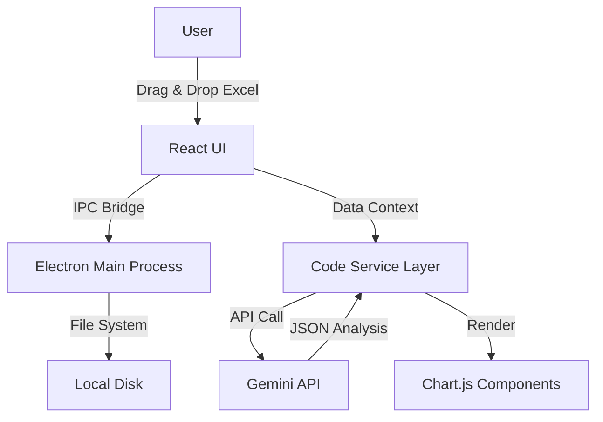

# AI Data Extractor 🚀

> [!CAUTION]
> **PROPRIETARY SOURCE CODE.**
> This repository is published for **portfolio and technical evaluation purposes only**.
> All rights are reserved. Commercial use, reproduction, or distribution is strictly prohibited.
> © 2024 Pablo D Ojeda M.

   

> **Democratizing Business Intelligence with Local AI.**
> A powerful desktop application that allows executives to "chat" with their raw Excel data, extracting strategic insights without needing data analysts or cloud uploads.


## 🌟 Not Just Another Wrapper

While many apps wrap ChatGPT, **AI Data Extractor** introduces a novel **Local-First Architecture** for enterprise data privacy:

1. **Local Ingestion:** Reads massive Excel/CSV files directly from the file system using Electron.
2. **Edge Processing:** Pre-processes data (normalization, summary generation) *before* it touches the AI.
3. **Context-Aware Analysis:** Uses a sliding-window context mechanism to allow LLMs (Gemini Pro) to understand datasets larger than their context window.
4. **Zero-Retention:** Data is processed in-memory and forgotten instantly. No databases. No training on user data.

## 🛠 Tech Stack

Built with a focus on performance, security, and developer experience.

* **Core:** [Electron](https://www.electronjs.org/) (Main Process), [React](https://react.dev/) (Renderer).
* **Language:** TypeScript (Strict Mode).
* **State & Logic:** Custom Hooks, Context API.
* **AI Integration:** Google Gemini Pro via direct API (BYOK Model).
* **Data Visualization:** Chart.js with custom React wrappers.
* **Styling:** TailwindCSS + CSS Modules for a premium "Dark Mode" aesthetic.
* **Auth:** Supabase (for license validation).
* **PDF Generation:** `html2pdf.js` for exportable executive reports.

## 💡 Key Features

* **🗣️ Natural Language Querying:** "Analízame las ventas de Q4 y compáralas con el año anterior".
* **📊 Dynamic Chart Generation:** The AI decides which chart (Bar, Line, Doughnut) best fits the data and generates it on the fly.
* **🔒 Enterprise-Grade Privacy:** "Bring Your Own Key" architecture ensures you control your API usage.
* **📑 Executive Reports:** One-click generation of professional PDF reports ready for board meetings.
* **⚡ Local Performance:** Optimized for handling files with 50,000+ rows without UI freezing.

## 🚀 How to Run Locally

```bash
# Clone the repository
git clone https://github.com/yourusername/ai-data-extractor.git

# Install dependencies (Node 18+)
npm install

# Start Development Server (Vite + Electron)
npm run electron
```

## 🏗 Architecture Overview



## 🤝 Contributing

This project is open source. Feel free to open issues or PRs.

## 📄 License

MIT © 2024 Pablo
